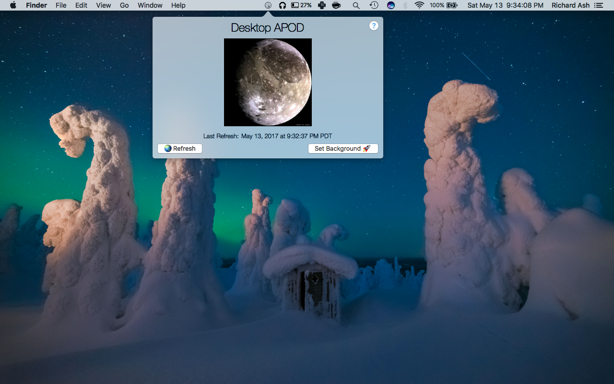
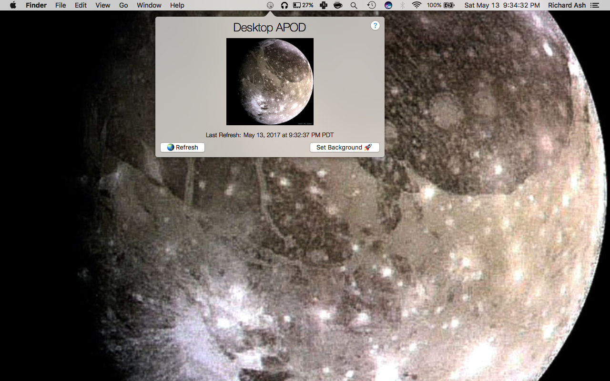

# Desktop APOD

Desktop APOD is a Mac App that will fetch the most recent Astronomy Picture of the Day (APOD) from NASA's website and set it as your desktop background!

## Screen shots

## Download

[Download the App here!](https://github.com/rwash8347/desktop-apod/raw/master/releases/DesktopAPOD.zip)
